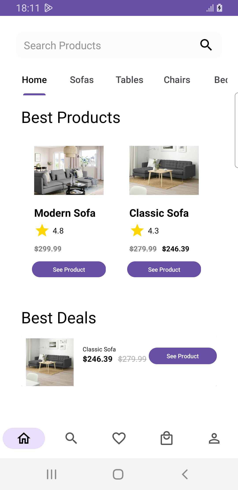
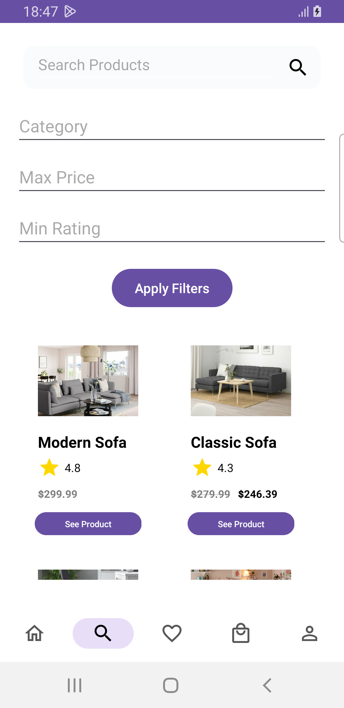
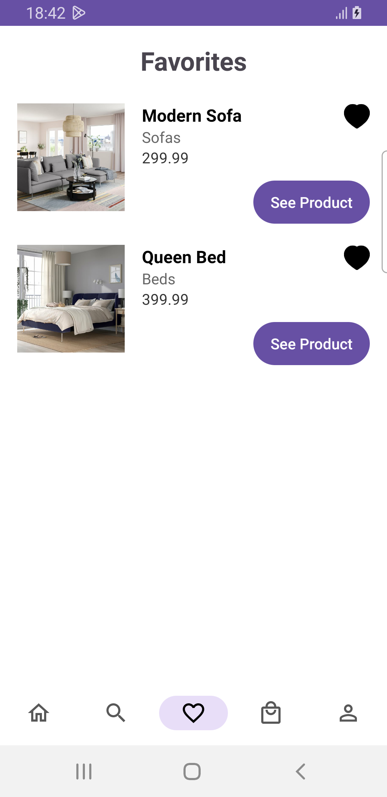
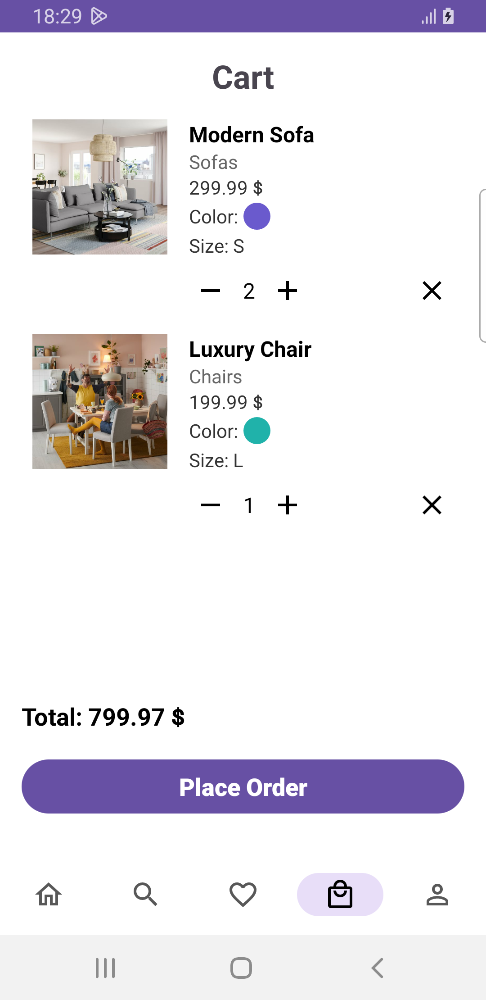
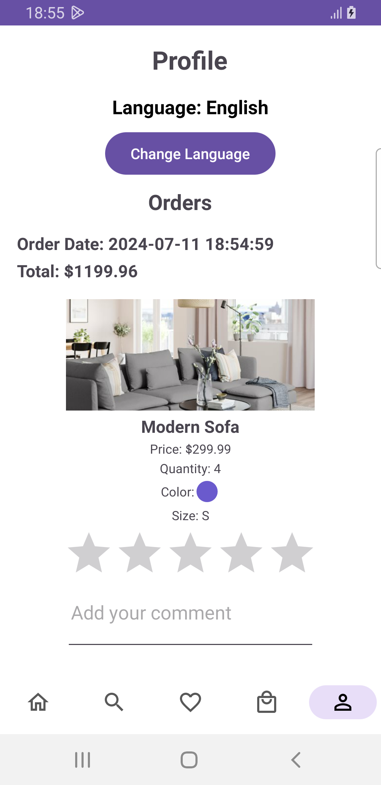

# E-Commerce Application

## Introduction

This project involves developing an e-commerce application using Android Studio and Kotlin. The app enables users to:

- Browse a product catalog
- View product details
- Manage shopping and wish lists
- Search for products using filters
- Leave reviews and ratings
- Take advantage of discounts and offers
- Switch between two languages

The goal is to provide a user-friendly experience that facilitates the organization and execution of purchases.

## Application Description

The application focuses on home furniture products. Detailed functionalities for each page are described below.

### Home Page

- Displays layouts for best products and deals
- Shows product images, prices, discounts, and ratings
- Categorizes furniture and provides detailed views
- Allows adding products to favorites or cart
- Provides search functionality



### Search Page

- Allows searching with filters based on categories, prices, and ratings
- Displays products matching the search criteria



### Favorites Page

- Shows favorite products or a message if none are added
- Allows viewing product details and removing products from favorites



### Cart Page

- Displays added products with details like color and size
- Allows managing quantity, removing products, and placing orders



### Profile Page

- Displays order details including date, time, cost, and product information
- Allows reviewing and commenting on products
- Supports language change between English and Greek



## Installation

1. Clone the repository:
   ```sh
   git clone https://github.com/armandok0/Ecommerce-App.git
